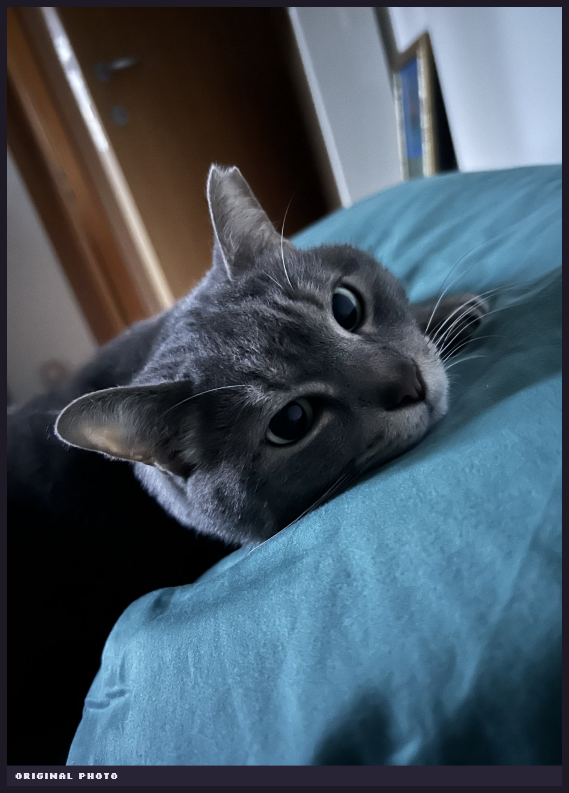
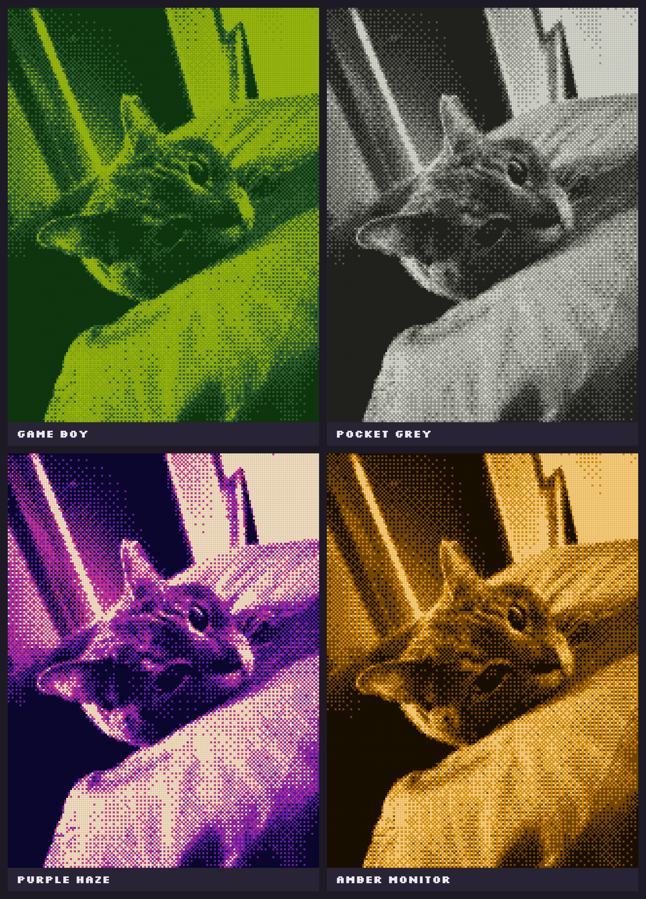

# SpriteCam

Turn a photo into handheld-console pixel art: tiny palettes, dithering and an old LCD screen look.
It runs entirely in your browser. No AI, no server, and your photos never leave your device.

**Try it:** https://liandri-00.github.io/SpriteCam/

| Before | After (Game Boy, Pocket grey, Purple haze, Amber monitor) |
|---|---|
|  |  |

## Features

- **19 palettes**: 13 four-color handheld palettes (Game Boy, Mint handheld, Pocket grey, Sunset…),
  1-bit, ink on paper, CGA, amber and green monitors, and "From the photo", which picks 4 colors from each photo.
- **Resolution** from 144 to 320 pixels on the photo's short side. 160 is the default and keeps the retro feel.
- **LCD effect**: a gap between pixels, light or dark, like an old handheld screen.
- **Auto contrast** stretches dim or hazy photos across the whole palette.
- **Live camera**: the viewfinder shows the pixel art in real time, with the front or back camera.
- **Burst**: a 5-second countdown, then 5 shots one second apart; pick the best one from a filmstrip.
- **Save or share** a PNG with crisp, square pixels.
- Works on phones and can be added to the home screen.

## How it works

Everything is plain JavaScript with no dependencies. The image processing lives in
[`pipeline.js`](pipeline.js): pure functions with no DOM access, which run in a Web Worker in the page
and under Node for the tests.

1. **Resize.** The photo is halved step by step with high-quality interpolation down to the output size,
   which keeps fine detail from turning into noise.
2. **Auto contrast.** Brightness is stretched so the darkest 1% of pixels become black and the brightest 1% white.
   All three channels move by the same amount, so hues are kept.
3. **Palette.** Fixed palettes are used as they are. "From the photo" runs k-means with a fixed seed in the
   [Oklab](https://bottosson.github.io/posts/oklab/) color space, whose distances match perceived color differences.
4. **Dither and match.** An ordered Bayer 4×4 offset is added, then each pixel maps to the nearest palette color
   in Oklab. A small lookup cache keeps this fast.
5. **Display.** Every art pixel covers a whole number of device pixels, so pixels stay square at any screen scaling.
   The LCD grid is drawn at display time by the GPU: the art is scaled up with crisp pixels and a
   semi-transparent grid darkens the gaps, so switching modes is instant.

Ordered dithering was picked over Floyd–Steinberg on purpose. With small fixed palettes, error diffusion
tries to spread a hue the palette can't show (blue in a green palette) and leaves flat, blotchy patches.
The regular Bayer pattern also looks more like real handheld graphics.

A full render at 160 px takes about 10–35 ms on a desktop CPU.

### Live camera

Camera frames go through the same worker, one frame in flight at a time, so a slower phone simply
gets fewer frames per second. With "From the photo", each frame starts k-means from the previous
frame's colors (one round over ~2000 pixels instead of a cold start), which is cheaper and stops the
palette from flickering. A shot grabs the full camera frame and then works like any chosen photo.
Inside in-app browsers (Instagram, LinkedIn…), where camera streaming is unreliable, Take photo falls
back to the phone's own camera app.

## Privacy

There is no backend. The site is static files on GitHub Pages; photos are decoded and processed in your browser
and never uploaded. No cookies, no analytics, no third-party requests (fonts are self-hosted).
See the [privacy note](privacy.html).

## Running locally

Any static file server works, for example:

```sh
npx serve .
# or
python -m http.server
```

Opening `index.html` straight from disk also works; the processing then runs on the main thread,
because some browsers block Web Workers on `file://` pages.

Run the pipeline tests with Node 22 or newer:

```sh
npm test
```

`tools/` has the scripts that regenerate the app icons, the README images and the link-preview card.

## License

SpriteCam is free software under the [GNU General Public License v3.0 or later](LICENSE).
You can use, study, change and share it; if you distribute a modified version,
including by hosting it, it must stay under the GPL with its source available.

The fonts in [`fonts/`](fonts/) keep their own SIL Open Font License.

## Credits

- Fonts: [Silkscreen](https://fonts.google.com/specimen/Silkscreen) and
  [Atkinson Hyperlegible](https://www.brailleinstitute.org/freefont/), both under the SIL Open Font License
  (see [`fonts/`](fonts/)).
- Palette names such as "Game Boy" describe a look; this project isn't affiliated with Nintendo or any
  other hardware maker.
